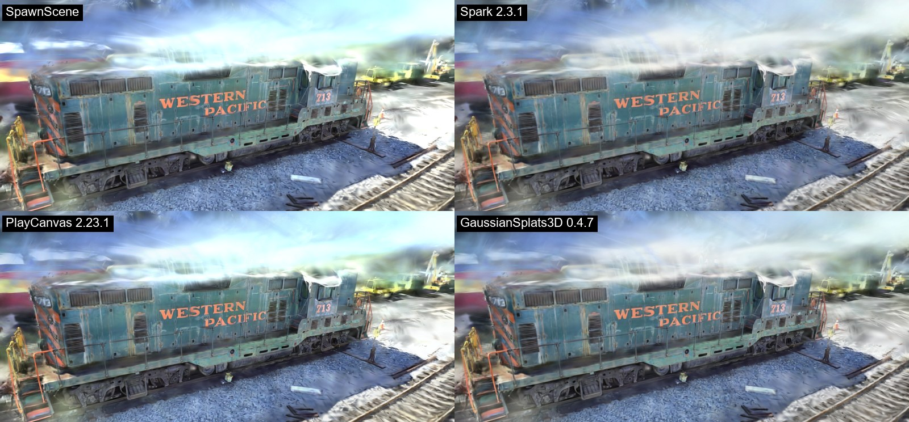
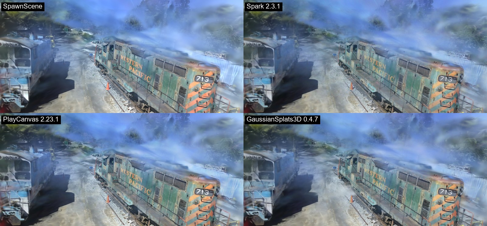
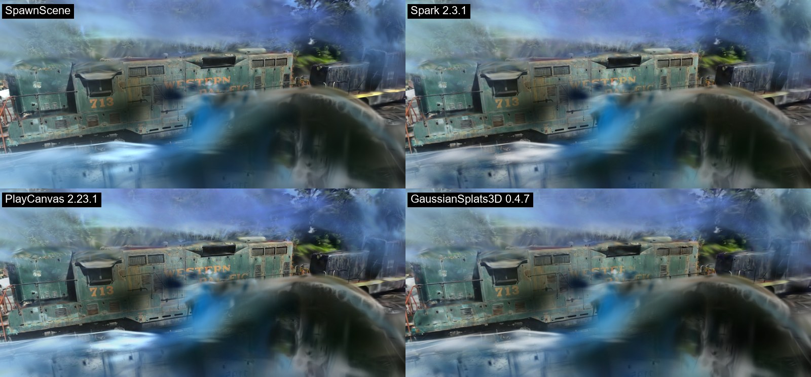

# SpawnScene benchmarks

How SpawnScene's scenes and viewer compare with other Gaussian splatting tools, measured, with the protocol stated so
anyone can repeat it. Every number here comes from a run whose log is kept; where a comparison is still being measured
it says so.

## Protocol

- **Held-out photos.** Every 8th photo (sorted by name) is never trained on; PSNR and SSIM are measured on those -
  the standard 3DGS / Mip-NeRF 360 split (`--test_every 8` in gsplat, `llffhold=8` in SpawnScene).
- **Same inputs.** Same photos at the same resolution and, unless stated, the same COLMAP camera poses for every tool -
  a comparison of trainers, not of pose estimators.
- **Same iteration count** (7K or 30K, the reference's two checkpoints).
- **Fair exposure score** (SpawnScene logs it for every run): phone photos are exposed one by one, so we also fit each
  held-out photo's per-channel gains on its LEFT half and score its RIGHT half - the reference 3DGS's
  `--train_test_exp` protocol. Without it a scene that learned the photos' average exposure is scored against photos it
  was never meant to match.
- Hardware: NVIDIA RTX 4070 (12 GB), Chrome 151, Windows 11. gsplat on the same machine (CUDA 12.4, PyTorch 2.4.1).

## Training quality

| Scene | Iterations | Metric | SpawnScene (WebGPU, in a browser tab) | gsplat 1.5.3 `default` (CUDA) |
|---|---|---|---|---|
| Tanks and Temples *Truck* (all 251 photos, 979 px) | 30K | PSNR / SSIM | 24.95 dB / **0.887** | **25.13** dB / 0.877 |
| | | splats | **0.89M** | 3.79M |
| | | time | 25 min | - |
| Mip-NeRF 360 *Bicycle* (194 photos, 1237 px) | 7K | PSNR / SSIM | **25.07 dB / 0.766** | 23.14 dB / 0.666 |

Provenance: Truck - SpawnScene run c49 (2026-10-06), gsplat run of the same date and split. Bicycle - SpawnScene run k1
(2026-10-07, COLMAP poses), gsplat 7K from 2026-10-06 at the same resolution and split. **A fresh paired re-run of both
tools with the logs published here is in progress.**

### Without COLMAP

SpawnScene places the cameras itself (learned matching + GPU structure from motion). On Bicycle the held-out score with
its own poses is 25.17 dB / 0.765 (run b0r, 2026-10-08) against 25.07 / 0.766 with COLMAP's - posing in the browser
costs nothing measurable there.

### Phone captures

The benchmarks have no auto exposure and no thin coverage; phone photos of a room have both. A 35-photo capture of a
bathroom (held out every 8th photo):

| SpawnScene version | held out PSNR / SSIM | fair score |
|---|---|---|
| before 2026-10-07 (sparse SfM init, no exposure model) | 15.58 dB / 0.709 | - |
| + seeds from the photos' depth | 16.88 / 0.796 | 18.88 |
| + per-photo exposure gains (current default) | **18.57 / 0.844** | **24.32** |

## Viewer

The same scene in four browser viewers, from the same seven camera poses: Inria's *Train* at 7K iterations
(741,883 splats, SH degree 3, the reference trainer's PLY), 1600x900 at device pixel ratio 1, vertical field of view
50°. Pose 0 is a home view; poses 1-6 are pseudo-random (seeded) around the scene - 5-35° above it, 1.2-2.2 scene
radii away - so no viewer was tuned for them. Measured 2026-10-08 on an RTX 4070 (driver 596.21), Chrome 151,
Windows 11. Tools: `tools/viewer-bench/` (pages, `make_poses.py`, `compose_sheets.py`) and
`tools/_cdp_viewer_bench.js`.

| Viewer | Version | API | Defaults changed |
|---|---|---|---|
| SpawnScene | 2026-10-08 | WebGPU | none |
| [Spark](https://sparkjs.dev) | 2.3.1 (three.js 0.186.1) | WebGL2 | none |
| [PlayCanvas](https://playcanvas.com) (SuperSplat's engine) | 2.23.1 | WebGL2 | none |
| [GaussianSplats3D](https://github.com/mkkellogg/GaussianSplats3D) | 0.4.7 | WebGL2 | SH degree 3 (its default is 0) |

### What they draw

All four draw the same picture; differences are small and mostly sharpness. SpawnScene applies contrast-adaptive
sharpening by default (strength 0.5, a Settings slider), so its frames look crisper than the raw blend the others show.
Mean absolute pixel difference from GaussianSplats3D (0-255, the frame band below): SpawnScene 8.6-17.4, PlayCanvas
6.5-12.5, Spark 3.9-6.7.

All seven: [img/viewer-bench/](img/viewer-bench/) (`train-pose0..6.jpg`).

### Frame rate

At the display's 60 Hz every viewer held 60 fps at every pose. Uncapped (Chrome with vsync and the frame-rate limit
off), frames per second, two rounds:

| Pose | SpawnScene | Spark | PlayCanvas | GaussianSplats3D |
|---|---|---|---|---|
| 0 | 261 / 261 | 1149 / 784 | 491 / 504 | 474 / 473 |
| 1 | 309 / 309 | 403 / 145 | 969 / 585 | 555 / 559 |
| 2 | 267 / 267 | 670 / 485 | 531 / 1074 | 462 / 463 |
| 3 | 259 / 259 | 425 / 585 | 317 / 368 | 425 / 425 |
| 4 | 240 / 240 | 437 / 809 | 337 / 470 | 415 / 414 |
| 5 | 222 / 221 | 212 / 413 | 310 / 251 | 392 / 392 |
| 6 | 238 / 238 | 719 / 305 | 458 / 468 | 421 / 415 |

What this says, plainly:

- **SpawnScene is the slowest of the four uncapped**, at 221-309 fps (3.2-4.5 ms a frame) against 392-559 for
  GaussianSplats3D. The gap is a steady factor, not a fixed overhead: SpawnScene runs at 0.55-0.61x GaussianSplats3D's
  rate at every pose, rising and falling with it, so the extra cost grows with the splats drawn. Finding it is open
  work. Drawing every splat (`&lodpx=0`, no 0.3 px cull) measured the same.
- **SpawnScene and GaussianSplats3D repeat within 1%** between rounds. Spark and PlayCanvas do not: up to 2.8x apart
  at an unchanged camera.
- **The uncapped numbers do not measure the same work.** Spark, PlayCanvas and GaussianSplats3D sort on a worker
  thread and draw each frame with the latest finished order. Uncapped, Spark's sort fell behind its drawing: at poses
  4-6 in some rounds it drew with a stale order (the train's far side painted over its near side). At 60 Hz the same
  poses drew correctly, and those are the Spark frames shown above. A frame counter cannot see that, so read the
  Spark and PlayCanvas columns as drawing speed, not sorted-drawing speed.

### Where SpawnScene's frame time goes

Measured with harness-only switches on the same poses ([Research/viewer-speed-2026-10-08.md](../Research/viewer-speed-2026-10-08.md)):

- **The 16-bit float blend target.** SpawnScene blends splats into an `rgba16float` image; the same renderer blending
  into 8 bits runs 1.37-1.42x faster. We keep 16 bits on purpose: 8-bit blending changes the picture by up to 120/255
  in places (24-30 dB) - it clamps after every splat, while the trainer composites unclamped - and cost the viewer
  0.7-3.6 dB against the trainer's own renders when we measured it (2026-09-24).
- **Not pixel count.** Ellipse-aligned quads rasterise about 20% fewer pixels than SpawnScene's axis-aligned ones and
  give an identical image, but measured no faster. A depth attachment that rejects nothing costs under 1%.
- **Which pictures agree** (mean PSNR over the seven poses): SpawnScene and PlayCanvas 31.2 dB; SpawnScene's 8-bit
  variant and Spark 31.7 dB, and GaussianSplats3D 30.2 dB; GaussianSplats3D and Spark 30.1 dB; SpawnScene and
  GaussianSplats3D 23.8 dB. Which of these is closest to a reference renderer at these poses has not been measured yet.

### Formats

SpawnScene opens 3DGS `.ply`, SuperSplat compressed `.ply`, PlayCanvas `.sog`, Niantic `.spz` (v2/v3) and `.splat`,
decoding all of them on the GPU. Each decoder is tested against the format owner's reference decoder (ported) and
verified on the owner's published sample files - see [Research/scene-formats-2026-10-08.md](../Research/scene-formats-2026-10-08.md).

## Training in a browser: who else does it

[Brush](https://github.com/ArthurBrussee/brush) (Rust, wgpu) also trains 3DGS in a browser tab. **A paired comparison on
the scenes above is in progress.** Desktop trainers (gsplat, the reference 3DGS) are the quality bar.
